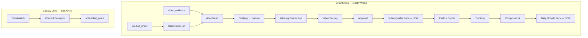

# AutoScale Engine Audit

**Date:** 2026-06-23  
**Repo:** [lukesystems/Auto-Scale](https://github.com/lukesystems/Auto-Scale)

This audit maps what exists in code today versus the target loop:

```txt
Product URL → Product Intelligence → VideoTrend evidence → Winning Format Lab
→ Video Strategy → Video Factory → Quality Gate → Postiz → Tracking → Compound → Daily Growth Pack
```

---

## 1. What is already implemented

### Auth & projects
- Supabase auth, protected routes, RLS (`middleware.ts`, `app/auth/`)
- Project CRUD (`app/(app)/projects/`)

### Product intelligence
- AutoBrief from product URL (`services/autobrief/`, `app/(app)/projects/[id]/brief/`)
- `product_briefs` table (`supabase/migrations/0001_init.sql`, `0006_loop1_product_brief_source_of_truth.sql`)
- Product site crawl + discovery (`services/intelligence/product-crawl/`, `services/intelligence/discovery/`)
- Competitor intelligence (`supabase/migrations/0011_competitor_intelligence.sql`)

### Video evidence (Growth Run input)
- Manual URL import (`services/intelligence/video/manual-video-import.ts`, `app/(app)/projects/[id]/video-intelligence/`)
- Discovery adapters exa/brave/firecrawl (`services/intelligence/video/discover-video-evidence.ts`)
- Tables: `video_evidence`, `video_metrics_snapshots`, `video_patterns` (`0013_video_evidence.sql`)

### Growth Run spine
- Orchestrator (`services/growth-run/orchestrator.ts`)
- Repository + schema (`services/growth-run/repository.ts`, `schema.ts`)
- UI: hub + run detail (`app/(app)/projects/[id]/growth/page.tsx`, `[runId]/page.tsx`)
- Server actions (`app/(app)/projects/[id]/growth/actions.ts`)
- Tables: `growth_runs` and ~25 related tables (`supabase/migrations/0014_growth_run.sql`)

### VideoTrend
- Generator (`services/videotrend/generate.ts`)
- Table: `video_trend_reports` (1:1 with `growth_run_id`)
- Reads `product_briefs`, `video_evidence`, `video_patterns`

### Video strategy + loadout
- Generator (`services/video-strategy/generate.ts`)
- Tables: `video_strategies`, `posting_loadouts`
- Reads `learning_memory`, `kill_decisions` for compounding feedback

### Winning Format Lab
- Planner (`services/video-factory/concepts.ts`)
- Schema (`services/winning-format/schema.ts`)
- Tables: `format_fingerprints`, `controlled_experiments`, `experiment_cells`, `trend_receipts` (`0016_winning_format_lab.sql`)
- UI panel on run detail page

### Video Factory (v1)
- Orchestrator (`services/video-factory/index.ts`)
- Script, storyboard, assets, captions (`script.ts`, `storyboard.ts`, `assets.ts`, `captions.ts`)
- Slide renderer + ffmpeg assembler (`slide-renderer.ts`, `assembler.ts`, `ffmpeg.ts`)
- Full render pipeline (`render-concept.ts`)
- fal Seedance b-roll (`fal/seedance.ts`)
- Storage upload (`storage.ts`, bucket `growth-media` in `0015_growth_media_bucket.sql`)
- Tables: `video_concepts`, `video_scripts`, `storyboards`, `storyboard_scenes`, `generated_assets`, `videos`, `video_captions`

### Postiz scheduling
- Client (`services/postiz/client.ts`)
- Multi-account scheduler (`services/postiz/multi-account.ts`)
- Connected accounts sync (`growth/actions.ts` → `connected_accounts`)
- Tables: `connected_accounts`, `schedule_items`, `account_health_log`, `tracked_links`

### Tracking
- Tracked links (`services/tracking/links.ts`)
- Pixel + signup + payment APIs (`app/api/pixel/route.ts`, `events/signup`, `events/payment`)
- Tables: `link_click_events`, `pixel_events`, `signup_events`, `payment_events`, `video_run_metrics`

### Compound v2
- Classifier (`services/compound/classify.ts`)
- Winner materialization (`services/compound/materialize-winner.ts`)
- Tables: `growth_experiment_results`, `winner_variants`, `kill_decisions`, `learning_memory`

### Export
- Growth run ZIP (`services/export/growth-run-pack.ts`, `app/api/projects/[id]/growth/[runId]/export/route.ts`)
- Legacy post export (`services/export/pack.ts`)

### Autopilot (thin)
- Cron tick (`services/autopilot/run.ts`, `app/api/cron/autopilot/route.ts`)
- Rules table: `autopilot_rules` (`0014_growth_run.sql`)

### Legacy carousel loop (parallel, still active)
- TrendWatch (`services/trendwatch/`, `app/(app)/projects/[id]/trendwatch/`)
- Content Conveyor (`services/content-conveyor/`)
- Post quality gate (`services/quality-gate/check.ts`) — **posts only, not videos**
- Approval, schedule, experiments, winners for `generated_posts`

---

## 2. What is wired end-to-end

| Path | Status | Key files |
|------|--------|-----------|
| Start Growth Run → VideoTrend → Strategy → Concepts → Videos | **Wired** | `orchestrator.ts` → `videotrend/generate.ts` → `video-strategy/generate.ts` → `concepts.ts` → `video-factory/index.ts` |
| Winning Format Lab persistence | **Wired** | `concepts.ts` → `format_fingerprints`, `controlled_experiments`, `trend_receipts` |
| Slide-first MP4 render (when ffmpeg present) | **Wired** | `render-concept.ts` → `growth-media` bucket → `videos.status = ready` |
| Manual approve/reject/kill | **Wired** | `growth/actions.ts` → `decideVideoAction` |
| Schedule approved videos | **Wired** | `scheduleRunAction` → `postiz/multi-account.ts` |
| Growth run export ZIP | **Wired** | `growth/[runId]/export/route.ts` |
| Manual metrics → Compound | **Wired** | `recordMetricsAction` → `runCompoundAction` → `classify.ts` |
| Winner → child run + variants | **Wired (manual render)** | `materialize-winner.ts` |
| Manual video evidence import | **Wired** | `video-intelligence/actions.ts` → `manual-video-import.ts` |
| Autopilot auto-approve + schedule attempt | **Partial** | `autopilot/run.ts` (no quality gate pre-check before this pass) |

**Happy path today (with Supabase + AI + ffmpeg):**

1. Save brief + import video evidence URLs
2. Start Growth Run from `/projects/[id]/growth`
3. Receive trend report, fingerprints, receipts, concepts, storyboards
4. Render slide MP4s (ffmpeg required)
5. Approve videos manually
6. Schedule via Postiz or export ZIP
7. Record metrics → Run Compound

---

## 3. What is only stubbed / planning-level

| Area | Evidence | Gap |
|------|----------|-----|
| `production_mode` system | Not in migrations pre-0017 | No explicit fast_slides / demo_short / ai_broll modes |
| Scene contract (purpose, visual_method, status) | `storyboard_scenes` had role + asset_method only | No structured scene plan UI/debug surface |
| Video quality gate | `quality_gate` AI task in model router only | No `video_quality_scores` or autopilot block |
| Daily Growth Pack | Referenced in planning docs only | No table, service, or UI |
| Autopilot rules UI | `autopilot_rules` table exists | No UI to create/edit rules |
| Autopilot start runs | `generation_volume` rule logs intent | Cannot start Growth Runs from cron |
| Winner variant render (service role) | `materialize-winner.ts` | Concepts created, videos `queuedForWorker` without render worker |
| Platform metric sync | `video_run_metrics.source = platform_api` | Nothing writes platform analytics |
| Postiz posted status | `schedule_items.posted_url` | No webhook sync; `videos` never auto-set `posted` |
| Scraping Engine autonomy | `docs/SCRAPING_ENGINE.md` | Discovery partial; no full adapter-backed social search |
| fal TTS / Seedance | Optional env keys | Silent audio / slide fallback when missing |
| Connected accounts on run start | `growth/actions.ts` | `connected_account_ids: []` hardcoded |
| Legacy vs Growth Run loops | Both active | Two parallel pipelines share Postiz naming |

---

## 4. What blocks VidGuy-level production

1. **No production mode system** — concepts use generic `video_type` without mode-specific scene templates.
2. **Slide renderer is basic** — single gradient, Arial text, no brand system, weak safe-zone handling (`slide-renderer.ts`).
3. **No screen recording / demo capture** — `screen_demo` creates asset rows but no real capture pipeline.
4. **No review/edit loop on scenes** — storyboards generated once; no in-UI scene editor.
5. **No resumable render worker** — partial failures require full re-run; no idempotent job queue.
6. **fal dependency for b-roll/voice** — production quality voiceover needs `FAL_KEY`; otherwise silent track.
7. **No hosted preview player with frame-accurate QC** — only status fields and export URLs.

---

## 5. What blocks reliable autopilot

1. **No autopilot rules UI** — rules must be inserted manually in DB.
2. **Cannot auto-start Growth Runs** — orchestrator requires user session (`createSupabaseServerClient`).
3. **No video quality gate** — autopilot can schedule low-quality renders.
4. **No worker for winner variant rendering** — compound spawns concepts but service-role path skips render.
5. **Schedule depends on captions** — videos without connected accounts get no captions → skipped silently.
6. **No inspectable skip log** — diagnostics returned but not persisted for audit.
7. **Compound needs manual metrics** — no platform ingestion; autopilot cannot learn without pixel/signup events or manual entry.
8. **`connected_account_ids` empty on run start** — loadout may not match synced accounts.

---

## 6. What blocks trusted trend evidence

1. **VideoTrend separate from legacy TrendWatch** — `video_trend_reports` uses `video_evidence`, not `trendwatch_sources`.
2. **Evidence optional at concept time** — AI can plan formats; receipts downgrade confidence but UI can still feel "proven".
3. **No transcript/frame analysis** — evidence is URL + metadata, not deep video understanding.
4. **Discovery adapters limited** — no TikTok/X/LinkedIn/YouTube native search (`AGENTS.md` explicitly not built).
5. **AI can hallucinate pattern IDs** — `concepts.ts` filters to allowed IDs, but observed_evidence text is not verified.
6. **Manual reference URLs work** — via `video-intelligence` import, but not surfaced on Growth Run start flow.

---

## 7. What blocks quality video output

1. **ffmpeg required** — without it, `videos.status` stays `rendering` (`video-factory/index.ts`).
2. **Basic slide design** — not platform-native typography or motion.
3. **No design quality check pre-publish** — hook timing, text density, CTA presence unchecked.
4. **No video-specific quality gate** — post gate (`services/quality-gate/check.ts`) does not apply to MP4s.
5. **Scene assets start `pending`** — actual pixels created only at render time; failures late in pipeline.
6. **No A/B thumbnail or hook frame optimization**.

---

## 8. Exact next implementation order

This pass implements items 1–9 below. Remaining after this pass marked **later**.

| # | Task | Files / tables |
|---|------|----------------|
| 1 | **Runtime verification harness** | `services/growth-run/verify.ts`, `scripts/verify-growth-run.ts`, `app/api/dev/verify-growth-run/route.ts` |
| 2 | **Production modes + scene contract** | `services/video-factory/production-modes.ts`, `scene-contract.ts`, migration `0017_engine_v2.sql` |
| 3 | **Fast slides upgrade** | `slide-renderer.ts`, `slide-quality.ts`, `scene-plan.ts` |
| 4 | **Video quality gate** | `services/video-quality/score.ts`, `video_quality_scores` table |
| 5 | **Wire quality into schedule/autopilot** | `postiz/multi-account.ts`, `autopilot/run.ts` |
| 6 | **Stricter trend receipts + reference URLs** | `concepts.ts`, video-intelligence on growth page |
| 7 | **Compound actions (scale/iterate/kill/inconclusive)** | `compound/classify.ts`, `format_fingerprints.paused_until` |
| 8 | **Daily Growth Pack skeleton** | `services/daily-growth-pack/`, `daily_growth_packs` table, UI route |
| 9 | **Scene plan visibility on run detail** | `growth/[runId]/page.tsx` |
| 10 | **Render worker for winner variants** | **later** — background job queue |
| 11 | **Autopilot rules UI** | **later** |
| 12 | **Platform metric ingestion** | **later** |
| 13 | **Postiz webhook / posted sync** | **later** |
| 14 | **Screen recording pipeline** | **later** — demo_short full implementation |
| 15 | **Scraping Engine adapters** | **later** per `docs/SCRAPING_ENGINE.md` |

---

## Architecture (current)



---

## Key file index

| Module | Path |
|--------|------|
| Growth orchestrator | `services/growth-run/orchestrator.ts` |
| VideoTrend | `services/videotrend/generate.ts` |
| Winning Format Lab | `services/video-factory/concepts.ts` |
| Video Factory | `services/video-factory/index.ts` |
| Render pipeline | `services/video-factory/render-concept.ts` |
| Postiz scheduler | `services/postiz/multi-account.ts` |
| Compound v2 | `services/compound/classify.ts` |
| Autopilot | `services/autopilot/run.ts` |
| Export pack | `services/export/growth-run-pack.ts` |
| Verification | `services/growth-run/verify.ts` |
